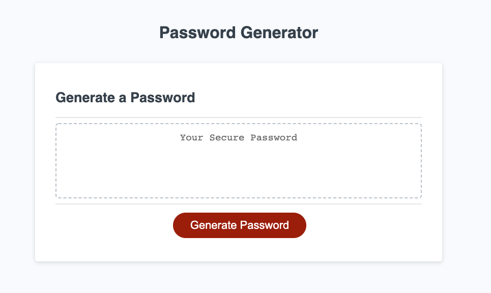

# Password Generator
Random password generator app that generates a random password based on the options selected by the user. Click the 'Generate Password' to trigger the password options prompts. Password length must be between 8 - 128 characters and one character type must be selected. Once the options have been selected, a random password will be generated and displayed in the center box.

## Technologies

- HTML5
- CSS
- Javascript
- Bootstrap v4.5.3
- VSCode
- Git

## Mock-Up

The following image shows the web application's appearance and functionality:

## Demo
- https://nvandenberge.github.io/PasswordGenerator/

